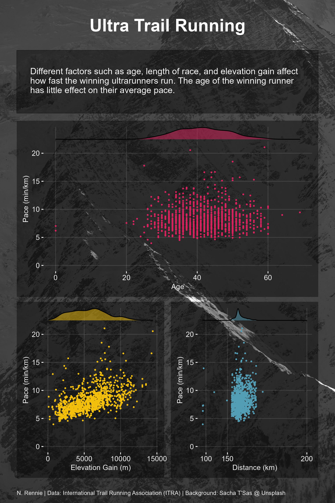
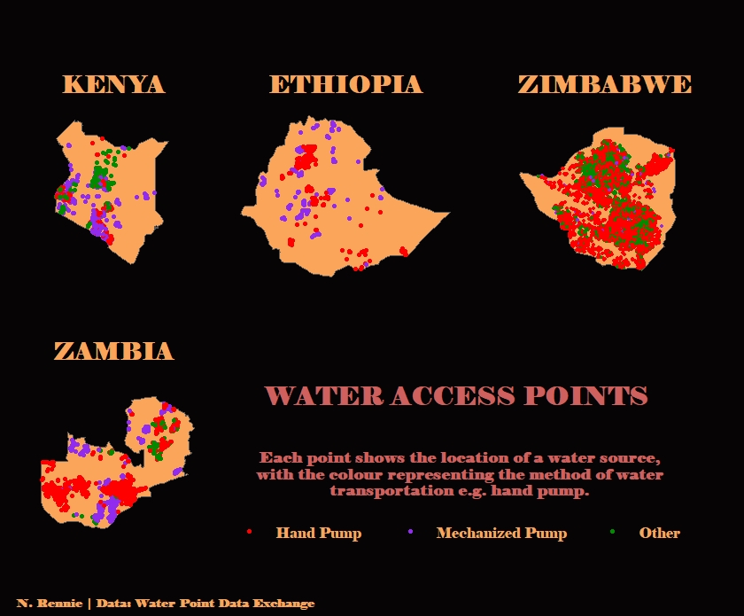
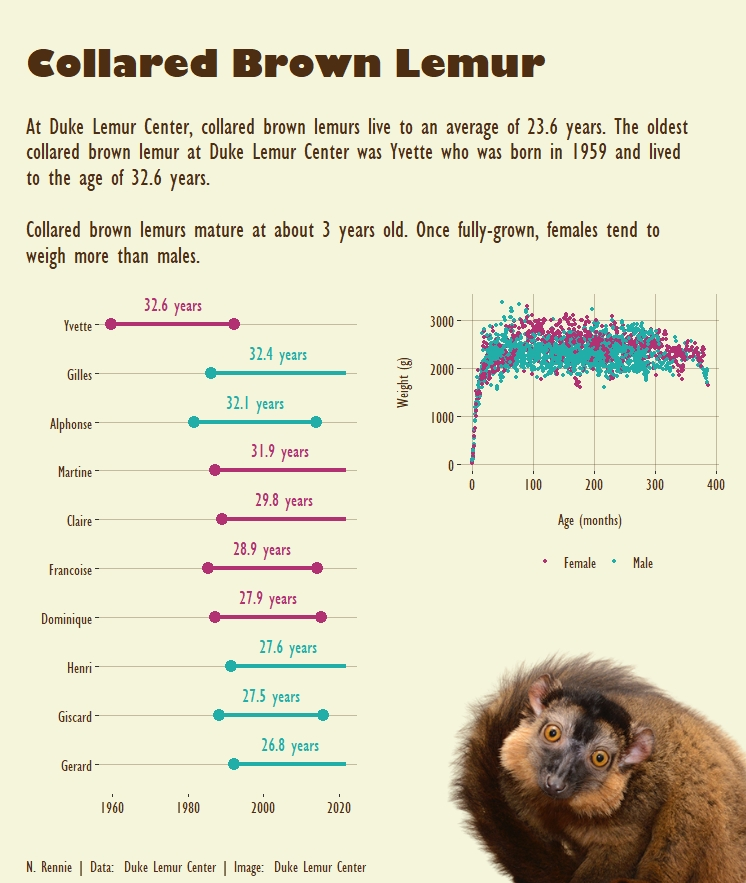
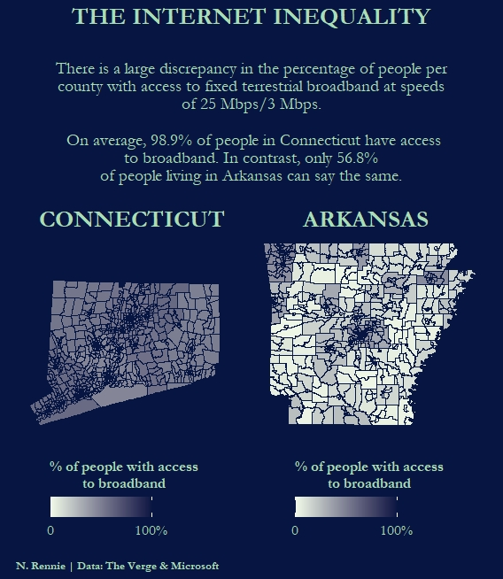

TidyTuesday is a weekly data project aimed at the R ecosystem. The project was borne out of the R4DS Online Learning Community and the R for Data Science textbook, with an emphasis on understanding how to summarize and arrange data to make meaningful charts with ggplot2, tidyr, dplyr, and other tools in the tidyverse ecosystem. Check it out at: [github.com/rfordatascience/tidytuesday](https://github.com/rfordatascience/tidytuesday).

These are examples of my data visualisations produced for the TidyTuesday challenges on Twitter. Code available at: [github.com/nrennie/tidytuesday](https://github.com/nrennie/tidytuesday).


```{r echo=F, out.width='100%', fig.align="center",fig.show='hold'}

```

```{r echo=F, out.width='100%', fig.align="center",fig.show='hold'}

```

```{r echo=F, out.width='50%', out.height="50%",fig.show='hold'}
knitr::include_graphics(c("images/12102021_f1.jpg", "images/12102021_f2.jpg"))
```
```{r echo=F, out.width='50%', out.height="50%",fig.show='hold'}
knitr::include_graphics(c("images/12102021_f3.jpg", "images/12102021_f4.jpg"))
```

```{r echo=F, out.width='100%', fig.align="center",fig.show='hold'}

```

```{r echo=F, out.width='100%', fig.align="center",fig.show='hold'}

```


