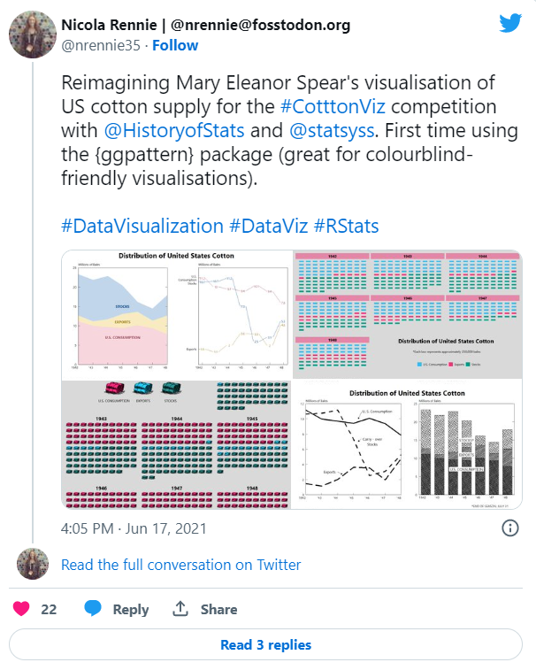
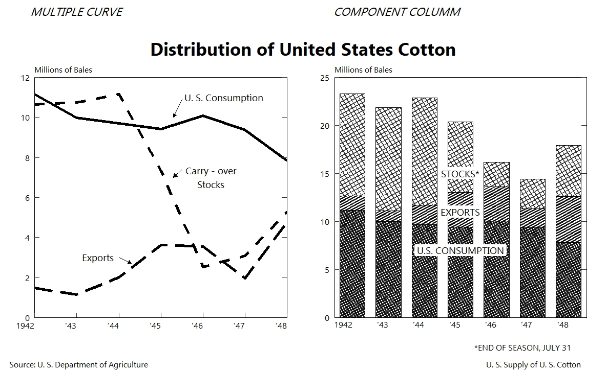
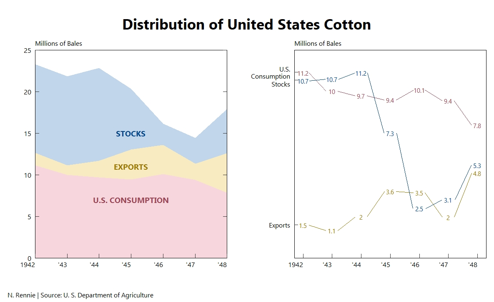
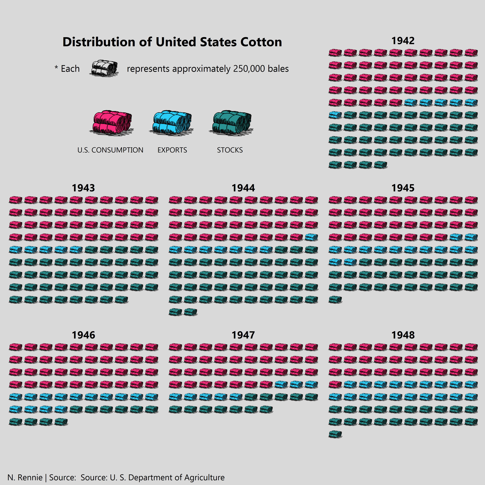

In June, the #CottonViz data visualisation challenge was run by the History of Statistics & Young Statisticians sections of the Royal Statistical Society (RSS). The challenge aimed to celebrate the work of Mary Eleanor Spear (1897 –1986), credited with popularising the *range-bar* charts.

The challenge invited particpants to either recreate Spears' original visualisation of US cotton supply (shown below), or design a new visualisation of the same data. 

The details of the challenge can be found on the [RSS website](https://rss.org.uk/news-publication/news-publications/2021/section-group-reports/mary-eleanor-spear-dataviz-competition-for-childre/). Prizes were available for:

* Most accurate recreation 
* Most creative
* Most innovative

I started by recreating the original viz using {ggplot2}. One of the things I really like about the original visualisation is the black and white nature of it. Instead, patterns are used to tell apart the bars, leading me to discover the {ggpattern} package in R.

I also made three other attempts at re-visualising the US cotton supply data. For my first visualisation I stayed similar to the original design and created a 2 x 1 plot, one an area plot and the other a line chart. 

The other two attempts were both waffle plots. The first was a simple faceted waffle plot showing the number of bales of cotton per year and where it was distributed. 

Although I liked the design of the first waffle plot, it wasn't overly creative and didn't reflect the *cotton* theme. So I decided to hand-draw some cotton bales (using Inkscape) and use these instead of tiles in my waffle plots. This plot won me an honourable mention from the judges. 

Congratulations to all winners, and thanks to the History of Statistics & Young Statisticians sections of the RSS for organising this event. The RSS news article can be found [here](https://rss.org.uk/news-publication/news-publications/2021/general-news/cottonviz-data-visualisation-challenge-winners-ann/).
