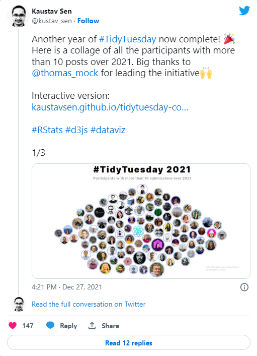
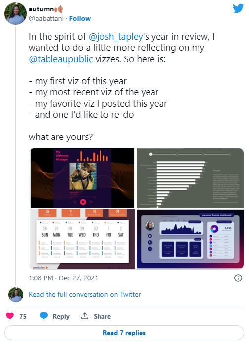
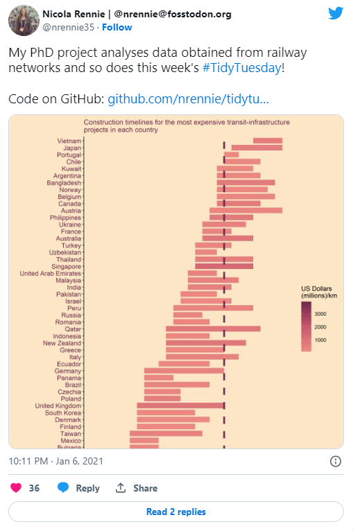
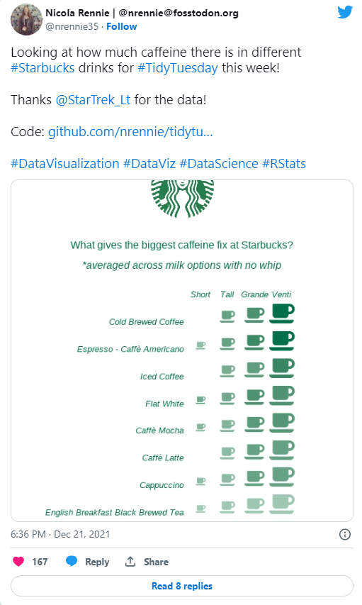
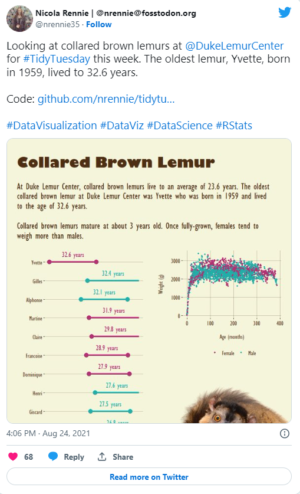
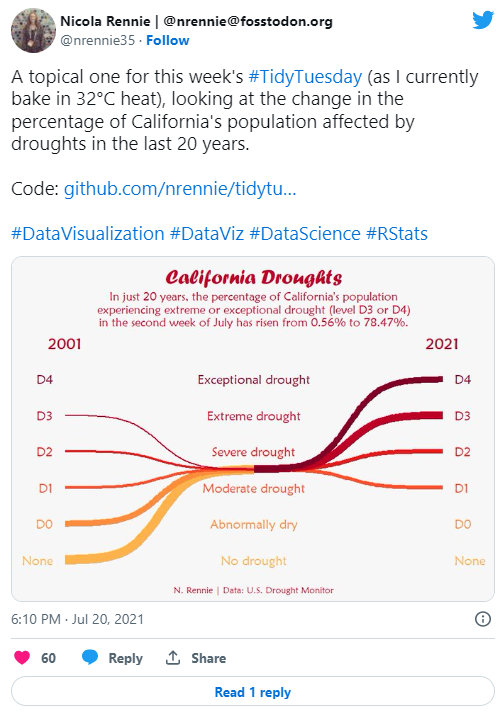

One of my goals for 2021 was to participate in the [#TidyTuesday challenge](https://github.com/rfordatascience/tidytuesday/) on a regular basis. This blog post reflects on the past year of data visualisations.

For those of you who don't know, #TidyTuesday is a weekly data challenge aimed at the R community. Every week a new dataset is posted alongside a chart or article related to that dataset, and ask participants explore the data. You can access the data and find out more [here](https://github.com/rfordatascience/tidytuesday/blob/master/README.md). 

This tweet from @[kustav_sen](https://twitter.com/kustav_sen) shows everyone who has participated in TidyTuesday at least 10 times this year.

The first thing I want to reflect on is what I was trying to achieve by taking part in TidyTuesday.

* I got better at processing data. The data sets for TidyTuesday are usually relatively clean, so this was more about getting comfortable with {tidyverse} packages like {dplyr} and {tidyr} to get data into the format I needed it to be. 
* I got faster at doing basic things in {ggplot2}. I don't need to look up syntax to change plot elements quite as much. Although Google still likes to remind me how often I've looked up multi-column legends...
* I tried out a lot of different (sometimes new, sometime old) packages in R, and discovered a lot of new ways of plotting data. Sometimes it worked, sometimes it didn't. 
* I found lots of cool people on Twitter who also think playing with data in their spare time is fun. 

I saw this tweet from @[aabattani](https://twitter.com/aabattani) reflecting on a year of Tableau vizzes, and I wanted to do the same for my #TidyTuesday contributions. 

## First visualisation

My first contribution to #TidyTuesday back in January 2021 visualised the cost of different infrastructure projects. I still quite like this plot, although there are a few things I'd do differently. I'd probably colour and sort these by continent because the order of countries doesn't make much sense. Different colours for pre- and post- 2021 expenditure may also be more helpful than a dashed line. I would also add a more detailed subtitle or summary to explain what's going on. 

In terms of R code, I reordered the variables manually by start date using `factor(df$country_name[order(df$start_year)],levels=df$country_name[order(df$start_year)])` and there are definitely better ways of doing this e.g. with `fct_reorder()`. 

Overall, I think this was a pretty good first attempt.

## Most recent visualisation

I had the idea for this one in my head when I saw the data set, so it was more about trying to create the idea I had rather than playing around with different ideas. 

The shades of green aren't quite different enough for the legend to be useful. Instead, I'd add the values as text underneath each icon, and add an arrow on the right hadn side to indicate increasing caffeine levels. 

I really like the clean, minimalist design of this one. 

## Favourite visualisation

My favourite data for #TidyTuesday in 2021 came from the Duke Lemur Center. One of the nice features was the personal data on each lemur, so you could track individual lemurs and their offspring over time. This was the point of the year, where I started to experiment with the graphic design side of visualisation more using package like {cowplot} and {patchwork} to combine plots and overlay images (like this one of an adorable lemur). 

I also ended up following the Duke Lemur Center on twitter after this so my twitter feed regularly features lemur photos which is no bad thing.

## Visualisation I'd like to redo

I remember having a bit of an idea for this plot, but not quite knowing how to create it, I ended up using the {ggbump} package to create the sigmoids. Several weeks later, I discovered that this was actually called a Sankey chart and that there was a {ggplot2} compatible R package for creating them called {ggalluvial}. I've used it several times since, and I think it would definitely improve the execution of this idea. 

## Final thoughts

Overall, #TidyTuesday has been one of the best and most fun work-related things I decided to do on 2021. During my PhD, although I had a lot of data, it all looked quite similar so there wasn't a lot of opportunity to experiment with different plots. #TidyTuesday is a nice environment to experiment with different plots and packages because you don't have to get it right. For me at least, it's about trying something new rather than making publication-ready plots. I'm definitely looking forward to participating in #TidyTuesday in 2022, and beyond. 

Huge thanks to @[thomas_mock](https://twitter.com/thomas_mock) for putting #TidyTuesday together every week, and thanks to everyone who contributed data. I might add some data of my own next year.
