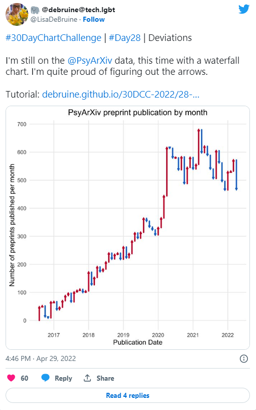
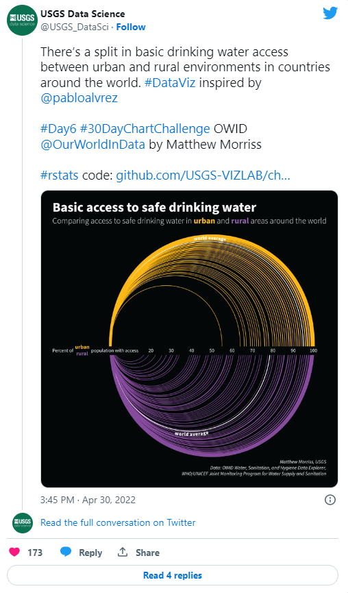
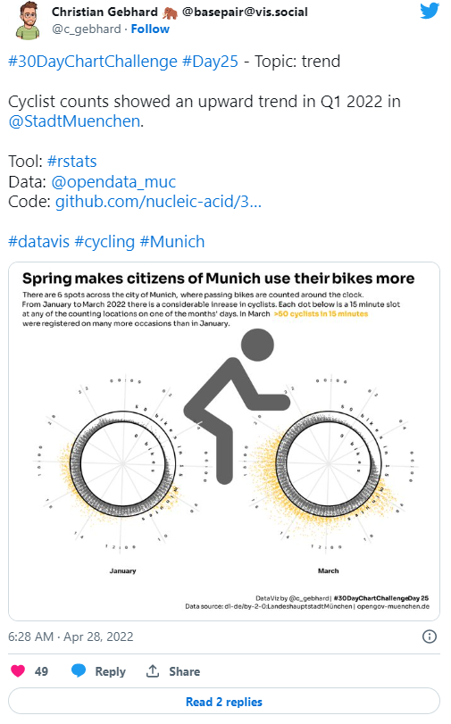

The #30DayChartChallenge is a data visualisation challenge organised by [Cédric Scherer](https://twitter.com/CedScherer) and [Dominic Royé](https://twitter.com/dr_xeo). Participants make one chart each day of the challenge, inspired by the daily prompt. The prompts are also split across 5 different categories. Check out the challenge at [twitter.com/30DayChartChall](https://twitter.com/30DayChartChall). All of my contributions can be seen on my [portfolio page](https://nrennie.rbind.io/portfolio/data-visualisation/#30daychartchallenge).

### Why did I create 30 charts?

There were a number of reasons I decided to participate in the #30DayChartChallenge:

* To engage with other people. As well as making my own charts, one of the best parts of the challenge is seeing charts that other people have made.I saw lots of charts that I'd never even thought of creating.
* To get better at making charts. After participating in the #30DayMapChallenge, I my ability to visualise spatial data definitely improved (blog post [here](https://nrennie.rbind.io/blog/2021-12-01-30-day-map-challenge-2021/)). The #30DayChartChallenge provided an opportunity to do the same for a wider range of charts.  
* To try new things in an informal environment. Before I started the challenge, I had a couple of ideas in the back of my mind that I wanted to try. In testing them out for a challenge like this, if they don't work - no one cares (except maybe me).
* Exposed to a wider range of tools. I've been participating in #TidyTuesday for a while and it's been really helpful. #TidyTuesday is primarily aimed at the R community, but the #30DayChartChallenge attracts people who make data visualisations using all sorts of tools. It's a good opportunity to see how else you can do the things you're already doing.  
* To have fun. Probably the most important reason. For me, data visualisation lies at the intersection of a bunch of things I really enjoy: statistics, science communication, art, programming... I genuinely enjoy data visualisation, and it's nice to be able to make the charts that I want to make. 

### How did I create 30 charts?

For the 2022 challenge, I used a range of tools to create my charts, including R, Python, Tableau, rawgraphs, Inkscape, and Figma. Most of the charts I created were built in R, but I used at least one "new" tool for each of the six categories. 

From both the new tools and new R packages I tried, there were lots of new cool things I learned. I'll talk about just a few here: 

* *`facet_zoom()` from {ggforce}*: Facets are a way of creating panels of plots where each panel shows a subset of data. `facet_zoom()` does exactly what the name suggests. It creates a second plot (or facet) which is a zooms in to an area of the main plot. I used this for the "Future" prompt to highlight the forecasted area of the line chart. I think this may be a good solution for bar charts where the bars are of similar height: it allows you to show the bars relative to each other, and highlight the differences.

* *Quarto*: Quarto is a new multi-language version of R Markdown (built by RStudio). It's likely something I will be using on a regular basis in the future, but I wanted a chance to play around with it informally first and the #30DayChartChallenge provided the perfect opportunity. The great thing about Quarto is being able to use R and Python code side by side (although my Python skills are a little rusty right now...)

* *Sentiment analysis*: I had played around with sentiment analysis in Python several years ago, but never actually tried it out in R. The {tidytext} package in R made it really easy. 

### What will I take from this going forward?

I've spent a lot of time in the past, (painstakingly) arranging annotations and logos on top of plots in R. It is possible but it's not the quickest way. In future, unless there is a programmatic need (e.g. I'll be making a plot lots of times), I'm more likely to add the final flourishes in something like Inkscape or Figma. There's no need for a chart to be 100% code.

Similarly, I'd like to explore less-programmatic ways of creating charts a bit more - tools liek Tableau or PowerBI are very popular. As someone who enjoys data visualisation it seems remiss of me not to spend more time working with them.

### My favourite chart

Of the 30 charts I made, it's difficult to pick a favourite. For me, the Goldilocks Decision Tree for the "storytelling" theme on day 29 probably wins. For this chart, I learned how to create a flowchart using {ggplot2} which was actually surprisingly tricky. The interpretation of the prompt also feels quite abstract (which I like), and I can't think of any other time when I'd make a plot quite like this.

###  Other favourite charts I saw

My twitter feed definitely got prettier during the month of April as it filled up with charts. I saw so many charts, it's impossible to list them all. So here are just a few of my personal favourites:

* I really liked this waterfall chart from [Lisa aDeBruin](https://twitter.com/LisaDeBruine). I'd never seen a chart like this before, but I really liked the up and down arrows. Lisa also made tutorials for every day of the challenge - they are super helpful!

* This chart from [USGS Data Science](https://twitter.com/USGS_DataSci) looks really beautiful - the intersection between data visualisation and art!

* This bicycle-inspired viz from [Christian Gebhard](https://twitter.com/c_gebhard) is really clever. A chart in the shape of its subject is very cool!

### Final Thoughts

I'd definitely recommend participating to anyone thinking about taking part in the the #30DayChartChallenge - and no, you don't **have** to do all 30 days. It was a lot of fun to create different charts, I learnt a bunch of new things, and I saw so many beautiful charts from other people.

Thanks to [Cédric Scherer](https://twitter.com/CedScherer) and [Dominic Royé](https://twitter.com/dr_xeo) for creating this challenge, and thanks also to [Wendy Shijia](https://twitter.com/ShijiaWendy) and [Marco Sciaini](https://twitter.com/shinysci) who supported the organisation. Well done to everyone who participated in this year's challenge whether you made one or thirty charts in April.
