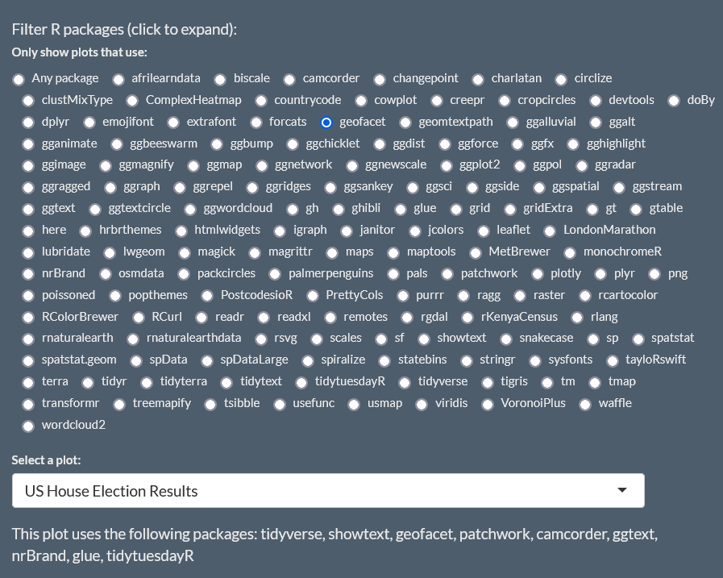
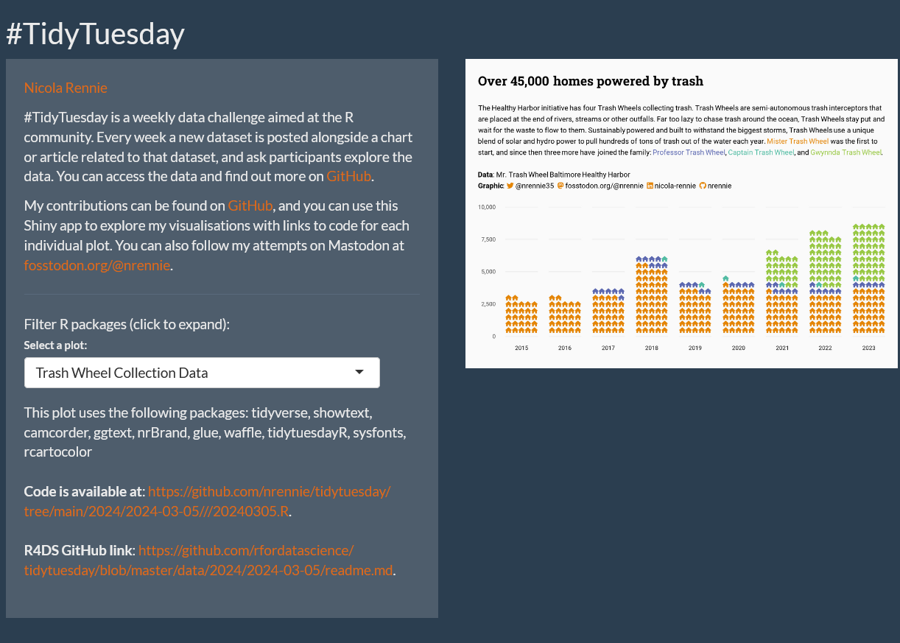

A Shiny app that automatically updates every week without the need to re-deploy it? Without the need to host a server running R? Sound too good to be true? It's not. Read on for an overview of how I built a Shiny app to browse and display my #TidyTuesday plots, which automatically updates every time I make a new plot.

## What is #TidyTuesday?

For those of you who don't know, #TidyTuesday is a weekly data challenge aimed at the R community. Every week a new dataset is posted alongside a chart or article related to that dataset, and ask participants explore the data. You can access the data and find out more on [GitHub](https://github.com/rfordatascience/tidytuesday). 

Over the past three years or so, I've created around 150 visualisations and I wanted some way of showcasing the work I'd done. Of course, the code and images are available on [GitHub](https://github.com/nrennie/tidytuesday) but it's not the nicest interface for browsing plots. I've also added some to my website, but it only shows the highlights - not hundreds of plots!

What I wanted was:

* an app that displays every #TidyTuesday plot I've created
* with functionality to search by packages used in creating the plots
* and links to the original code and data
* that updates by itself whenever I create a new plot
* and is free and easy to deploy

## Collecting the data

In order to display every plot I've created, the first thing I needed to do was get a list of all those plots. Luckily, all of the plots and their source code is stored in a nicely structured way on [GitHub](https://github.com/nrennie/tidytuesday).

> The blog post I wrote about [Creating template files in R ](https://nrennie.rbind.io/blog/script-templates-r/) and using them for #TidyTuesday code, explains how I enforced a particular structure to keep it consistent over the years. 

In particular, each image is stored in the GitHub repository with a name of the following form `/yyyy/yyyy-mm-dd/yyyymmdd.png`.* In each `yyyy/yyyy-mm-dd` folder there is also an R script titled `yyyymmdd.R` and a `README.md` file. The R for Data Science [GitHub repository](https://github.com/rfordatascience/tidytuesday) that provides the data also uses a date-based structure. Almost all of the meta data that we need for the plot is contained within the structure of the folders and files.

* except 2021 where I had the horrific `dd-mm-yyyy` date format instead of the `yyyy-mm-dd` format that we all know is best.

Let's start by getting a list of all the files in the directory where I keep all of my #TidyTuesday plots. I then want to process the names of those folders to extract information about the year and week each folder relates to. I also want to set up some empty columns to store information about the plot title, packages used, URL for the code, and the URL for the original data.

```r
# get list of all #tidytuesday folders
all_folders <- tibble::tibble(
  folders = list.dirs(path = ".", recursive = TRUE)
)

# get list of all weeks
all_weeks <- all_folders |>
  mutate(folders = str_remove(folders, "./")) |>
  separate_wider_delim(
    folders,
    delim = "/",
    names = c("year", "week"),
    too_few = "align_start",
    too_many = "drop"
  ) |>
  filter(year %in% c(2020, 2021, 2022, 2023, 2024)) |>
  drop_na(week) |>
  mutate(
    title = NA_character_,
    pkgs = NA_character_,
    code_fpath = NA_character_,
    img_fpath = NA_character_
  )
```

For each plot, there is also a README file where the first line is always `<h1 align="center">Name of Plot</h1>`. This means we can extract the plot name from the first line of the `README.md` file. Let's first create a helper function to extract strings from between a start and end character(s):

```r
# utils function
str_extract_between <- function(x, start, end) {
  pattern <- paste0("(?<=", start, ")(.*?)(?=", end, ")")
  return(stringr::str_extract(x, pattern = pattern))
}
```
We can then go through the list of files that end with `.md` (or `.MD`), read in the file's first line, and extract the title using our `str_extract_between()` function:

```r
# find README file
tt_readme <- list.files(file.path(tt_week$year, tt_week$week, "/"),
      pattern = "\\.md|\\.MD", full.names = TRUE
    )
# read README file
readme_txt <- readLines(tt_readme, warn = FALSE)[1]
# extract title
readme_title <- str_extract_between(readme_txt, start = ">", end = "<") |>
  stringr::str_trim("both")
```
> Here `tt_week` is a single row of the `all_weeks` data, and we can loop over each row, and add it to the `readme_title` column.

A similar process as above extracts the file name of the plot image, based on the file extension:

```r
tt_imgs <- list.files(file.path(tt_week$year, tt_week$week, "/"),
    pattern = ".png|.PNG|.jpg|.JPG|.jpeg|.JPEG", full.names = TRUE
  )
```

To be able to browse by packages, we need some way of figuring out which packages are used in each script:

```r
tt_file <- list.files(file.path(tt_week$year, tt_week$week, "/"),
    pattern = ".R", full.names = TRUE
  )[1]
tt_pkgs <- att_from_rscript(tt_file) |>
  stringr::str_flatten_comma()
```

For each plot, we start by getting the name of the relevant `.R` file. Then we can use the `att_from_rscript()` function from the {attachment} package to get the packages used in this script. This function looks for calls to `library()`, `require()`, or uses of `::` namespacing within the script.

With a little bit more processing using {dplyr} and {tidyr}, we can convert the list of packages to binary columns: each column relates to a specific package with a `1` in the column indicating the package was used, and a `0` indicating it wasn't. Now the data looks a little bit like this:

```r
# A data frame: 6 × 139
  year  week      title pkgs  code_fpath img_fpath afrilearndata
* <chr> <chr>     <chr> <chr> <chr>      <chr>             <dbl>
1 2020  2020-04-… GDPR… tidy… 2020/2020… 2020/202…             0
2 2020  2020-07-… Palm… tidy… 2020/2020… 2020/202…             0
3 2020  2020-12-… BBC … tidy… 2020/2020… 2020/202…             0
4 2021  01-06-20… Surv… tidy… 2021/01-0… 2021/01-…             0
5 2021  02-02-20… HBCU… read… 2021/02-0… 2021/02-…             0
6 2021  02-03-20… 2020… tidy… 2021/02-0… 2021/02-…             0
# ℹ 132 more variables: biscale <dbl>, camcorder <dbl>,
#   changepoint <dbl>, charlatan <dbl>, circlize <dbl>,
#   clustMixType <dbl>, ComplexHeatmap <dbl>,
#   countrycode <dbl>, cowplot <dbl>, creepr <dbl>,
#   cropcircles <dbl>, devtools <dbl>, doBy <dbl>, dplyr <dbl>,
#   emojifont <dbl>, extrafont <dbl>, forcats <dbl>,
#   geofacet <dbl>, geomtextpath <dbl>, ggalluvial <dbl>, …
# ℹ Use `colnames()` to see all variable names
```

We save the output to an Excel file and an `.RData` file. Though we only really need the `.RData` file, the Excel file is a little bit more human readable to help check the output is as we expect (a `.csv` file also works here). 

```r
# save file
writexl::write_xlsx(all_weeks, "data/all_weeks.xlsx")
save(all_weeks, file = "data/all_weeks.RData")
```

You can view the complete `make-data.R` script on [GitHub](https://github.com/nrennie/tidytuesday/blob/main/data/make-data.R).

## Automatically updating the data

This data is based on all plots that currently exist in the `tidytuesday` repository. That means that when we create a new plot next week, the data becomes out of date. We *could* manually re-run the `make-data.R` script each week. Or we could get GitHub to do it without asking. How? Via [GitHub Actions](https://github.com/features/actions).

GitHub Actions is a continuous integration and continuous delivery (CI/CD) platform that allows you to automate your build, test, and deployment pipeline. That means you can write a GitHub Actions workflow that runs the `make-data.R` script every time you push to main on GitHub i.e. every time a new plot is added.

Inside the `tidytuesday` repository, we create a folder called `.github/workflows`, and we create a file called `update-data.yml`. The name of the file doesn’t really matter, just that the file type is `.yml`, since this is how we write a workflow for GitHub Actions. The first part of the workflow is fairly standard:

```yaml
name: Update data

on:
   # Triggers the workflow on push or pull request events but only for the main branch
  push:
    branches: [ main ]
  # Allows you to run this workflow manually from the Actions tab
  workflow_dispatch:

# A workflow run is made up of one or more jobs that can run sequentially or in parallel
jobs:
  update:
    runs-on: ubuntu-latest
    env:
      GITHUB_PAT: ${{ secrets.GITHUB_TOKEN }}
    steps:
      - uses: actions/checkout@v2

      - uses: r-lib/actions/setup-r@v2
        with:
          use-public-rspm: true
```

This tells GitHub when to run the action (every time we push to main or manually ask for it to be run). It also tells GitHub to run it using the latest version of Ubuntu, and install R.

The next part of the workflow installs the R packages needed for `make-data.R` to run, and then runs `make-data.R`.

```yaml
      - name: Install dependencies
        run: |
          install.packages(c("attachment", "dplyr", "tidyr", "stringr", "writexl"))
        shell: Rscript {0}
        
      - name: Update data
        run: |
          source("data/make-data.R")
        shell: Rscript {0}
```
Finally, we want to commit the `.xlsx` and `.RData` files back to the GitHub repository so that we can use them:

```yaml
      - name: Commit files
        run: |
          git config --local user.email "actions@github.com"
          git config --local user.name "GitHub Actions"
          git add --all
          git commit -am "add data" || exit 0
          git push 
```

The full GitHub Action workflow is available on [GitHub](https://github.com/nrennie/tidytuesday/blob/main/.github/workflows/update-data.yml). Make sure you also allow GitHub Actions to run in the Settings of your GitHub repository.

> My previous blog post on [Automatically deploying a Shiny app for browsing #RStats tweets with GitHub Actions](https://nrennie.rbind.io/blog/2022-10-05-automatically-deploying-a-shiny-app-for-browsing-rstats-tweets-with-github-actions/) describes a similar process for scraping data from Twitter each week.

## Building a Shiny app

Shiny is an R package that makes it easier to build interactive web apps straight from R. If you haven't built a Shiny app before, the [Welcome to Shiny](https://shiny.posit.co/r/getstarted/shiny-basics/lesson1/index.html) instructions from Posit are a great place to start.

This is going to be a very simple Shiny app with just a couple of user inputs, some text, and an image to display so we're going to keep it simple and build it in a single `app.R` file. Let's start by loading the required packages and the data:

```r
library(shiny)
library(dplyr)
library(htmltools)
library(glue)
library(rlang)
library(shinythemes)

# Data
load(url("https://raw.githubusercontent.com/nrennie/tidytuesday/main/data/all_weeks.RData"))

# Get all plot titles and all packages used
all_titles <- all_weeks$title
all_pkgs <- dplyr::select(all_weeks, -c(year, week, title, pkgs, code_fpath, img_fpath))
all_pkgs <- colnames(all_pkgs)
```

We'll use the `all_titles` variable as the options for a dropdown menu that a user can use to choose which plot to display. The `all_pkgs` variable will provide options for radio buttons that a user can use to filter plots that use a specific package.

Now we can build the UI:

* The `shinytheme()` function from {shinythemes} styles the app;
* The `titlePanel()` function does what it says on the tin and adds a title panel;
* The `sidebarLayout()`, `sidebarPanel()`, and `mainPanel()` functions add a sidebar layout on the left where we'll keep all the user inputs and links, and the main panel on the right where the plot image will be displayed.
* The `markdown()` function processes markdown text to add some explanation about what the app does.
* The `htmltools::tags$details()` and `htmltools::tags$summary()` functions add a collapsible section. Inside the collapsed section, the `shiny::radioButtons()` adds the radio buttons to choose a package. The list is quite large so we want to hide it initially (although perhaps a dropdown would also work quite well here instead...)
* The `shiny::uiOutput`, `shiny::textOutput`, and `shiny::htmlOutput()` functions adds UI elements, text, and HTML code to the app - we'll create these elements based on the user inputs in the server code a little bit later.

```r
ui <- fluidPage(

  theme = shinytheme("superhero"),

  titlePanel("#TidyTuesday"),

  sidebarLayout(

    sidebarPanel(
      markdown("[Nicola Rennie](https://github.com/nrennie)

#TidyTuesday is a weekly data challenge aimed at the R community. Every week a new dataset is posted alongside a chart or article related to that dataset, and ask participants explore the data. You can access the data and find out more on [GitHub](https://github.com/rfordatascience/tidytuesday/blob/master/README.md).

My contributions can be found on [GitHub](https://github.com/nrennie/tidytuesday), and you can use this Shiny app to explore my visualisations with links to code for each individual plot. You can also follow my attempts on Mastodon at [fosstodon.org/@nrennie](https://fosstodon.org/@nrennie).
"),
htmltools::hr(),
htmltools::tags$details(
  htmltools::tags$summary("Filter R packages (click to expand):"),
  shiny::radioButtons("pkg_select",
                      "Only show plots that use:",
                      choices = c("Any package", all_pkgs),
                      selected = NULL,
                      inline = TRUE
  )
),
# choose a plot
shiny::uiOutput("select_img"),
# display information
shiny::textOutput("pkgs_used"),
htmltools::br(),
shiny::htmlOutput("code_link"),
htmltools::br(),
shiny::htmlOutput("r4ds_link"),
htmltools::br(),
width = 6
    ),

mainPanel(
  shiny::htmlOutput("plot_img"),
  htmltools::br(),
  width = 6
)
  )
)
```

<p align="center">

</p>

Then we add the server code. We have a `reactive()` element that determines which plot titles to display based on the user's choice of packages to include. This updated list of plot titles is then passed into `renderUI` to create the dropdown with these choices. Another `reactive()` element then gets the datethat relates to the selected plot. This date information is then used to create relevant text and links: a link to the image, a link to the R for Data Science data, a link to code on GitHub, and some text explaining which packages are used in the plot.

```r
server <- function(input, output) {
  # Get list of available plots
  all_titles <- reactive({
    req(input$pkg_select)
    if (input$pkg_select == "Any package") {
      all_titles <- all_weeks$title
    } else {
      all_titles <- all_weeks %>%
        dplyr::filter(!!rlang::sym(input$pkg_select) == 1) %>%
        dplyr::pull(title)
    }
  })

  # Select title
  output$select_img <- renderUI({
    shiny::selectInput("plot_title",
                       "Select a plot:",
                       choices = rev(all_titles()),
                       width = "90%"
    )
  })

  # Get data
  week_data <- reactive({
    req(input$plot_title)
    dplyr::filter(all_weeks, title == input$plot_title)
  })

  ## Image display
  img_path <- shiny::reactive({
    glue::glue("https://raw.githubusercontent.com/nrennie/tidytuesday/main/{week_data()$img_fpath}")
  })

  output$plot_img <- shiny::renderText({
    c('')
  })

  ### List of packages
  output$pkgs_used <- shiny::renderText({
    glue::glue(
      "This plot uses the following packages: {week_data()$pkgs}"
    )
  })

  ### Code link
  code_path <- shiny::reactive({
    glue::glue(
      "https://github.com/nrennie/tidytuesday/tree/main/{week_data()$code_fpath}"
    )
  })

  output$code_link <- shiny::renderText({
    glue::glue(
      '<b>Code is available at</b>: <a href="{code_path()}"  target="_blank">{code_path()}</a>.'
    )
  })

  ### R4DS link
  r4ds_path <- shiny::reactive({
    if (week_data()$year == "2021") {
      reformat_week <- as.character(as.Date(week_data()$week, format = "%d-%m-%Y"))
      glue::glue(
        "https://github.com/rfordatascience/tidytuesday/blob/master/data/{week_data()$year}/{reformat_week}/readme.md"
      )
    } else {
      glue::glue(
        "https://github.com/rfordatascience/tidytuesday/blob/master/data/{week_data()$year}/{week_data()$week}/readme.md"
      )
    }
  })

  output$r4ds_link <- shiny::renderText({
    glue::glue('<b>R4DS GitHub link</b>: <a href="{r4ds_path()}"  target="_blank">{r4ds_path()}</a>.')
  })
}
```

> Note: the `if` statement in the `r4ds_path` element is due to the alternative date format used in 2021.

We then use the `shinyApp()` function to combine the UI and server elements into a Shiny app object:

```r
shinyApp(ui = ui, server = server)
```

<p align="center">

</p>

The source code for the app can be viewed on [GitHub](https://github.com/nrennie/tidytuesday-shiny-app/tree/main/app).

## Deploying the Shiny app

Now we need to think about how to get the Shiny app off our laptops and out into the world. There are numerous ways to deploy Shiny apps - for example to [shinyapp.io](https://www.shinyapps.io/). The way that deployment approaches work is that the server and the client are separate: the shinyapps.io server runs the R code, and clients connect via a web browser. With the free tier of shinyapps.io, we're limited to how many apps and how much time we can use those servers for. What if the server and the client weren't separate?

[Shinylive (for R)](https://posit-dev.github.io/r-shinylive/) is a method of deployment where apps run entirely in the client’s web browser, without the need for a separate server running R. This is all thanks to [webR](https://docs.r-wasm.org/webr/latest/) - a version of R compiled for web browsers and Node.js using WebAssembly. WebR makes it possible to run R code in a web browser without the need for an R server. There are currently still some limitations of using shinylive - mainly the slower initial load time, and the fact that not all R packages can be used with webR. But many can, including all the ones we need for this Shiny app!

After installing the `shinylive` R package, we need to run:

```r
shinylive::export("app", "docs")
```
Assuming that the `app.R` file is stored in a folder called `app`, this converts your app into a Shinylive app and sticks it into a folder called `docs`. You can call these folders anything you like, I've picked `docs` because this is one of the special names recognised by [GitHub Pages](https://pages.github.com/). 

Then you can push all of the app code (including the `docs` folder) to GitHub. This could be in the same repository as the `tidytuesday` code, but to keep it cleaner I've put it in a separate [GitHub repository](https://github.com/nrennie/tidytuesday-shiny-app). To deploy using GitHub Pages, in your GitHub repository go to Settings -> Pages and select *Deploy from a branch* then choose `main/docs` as the source. Very soon you should see your Shinylive up and running! You can also deploy Shinylive to other static site hosting services if you'd prefer.

> You could also creat another GitHub Action to run `shinylive::export("app", "docs")` and deploy to GitHub Pages if you want to!

Since the R code is running in the web browser, and everything in the app is created using R code based on the input data, we don't need to re-deploy the app each week. It will update itself every time the data updates. You can view the app at [nrennie.rbind.io/tidytuesday-shiny-app](https://nrennie.rbind.io/tidytuesday-shiny-app/), though remember it does take a bit longer to load initially (better on a desktop than mobile!)

## Further resources

If you want to learn more about webR and Shinylive:

* This tutorial from Rami Krispin on how to [Deploy a Shinylive R App on Github Pages](https://github.com/RamiKrispin/shinylive-r) is an excellent introduction that walks you through the process in more detail than I've covered here.

* The [shinylive documentation](https://posit-dev.github.io/r-shinylive/) is also a good reference to have when creating your first Shinylive app!

* This walkthrough of [deploying a Shinylive for R app within Quarto](https://github.com/coatless-quarto/r-shinylive-demo) by James Balamuta shows you how to use Shiny in a [Quarto](https://quarto.org/) document, and deploy it using Shinylive.

* My previous blog post about [Seeing double? Building the same app in Shiny for R and Shiny for Python](https://nrennie.rbind.io/blog/seeing-double-shiny-python-r/) discusses Shinylive for Python - the ability to build Shiny apps in Python and deploy it within the need for a Python server.

<p align="center">
<br>
<small>Image: <a href="https://giphy.com/gifs/true-and-the-rainbow-kingdom-true-and-the-rainbow-kingdom-bartleby-LQ3cfzLDUQnfEWChJx">giphy.com</a></small>
</p> 
